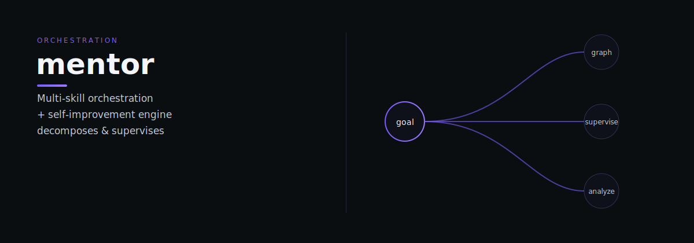

# mentor

mentor — Mentor: multi-skill orchestration and self-improvement engine — decomposes goals, supervises execution, analyzes outcomes.

> Tell it what you need. It does the work.

## What it does

Mentor operates in two modes. In **runtime mode** it decomposes goals into task graphs, supervises execution, and repairs failures through layered escalation. In **heartbeat mode** it reads journals from every skill, scores OKRs against baselines, and generates improvement proposals routed to Forge and Fellow. It also supports named **Workflow Plans** — pre-authored, parameterized task sequences invokable by name.

## Dependencies

- [Forge](https://github.com/indigokarasu/forge) — receives VariantProposal/VariantDecision files
- [Fellow](https://github.com/indigokarasu/fellow) — runs controlled benchmark experiments
- [Elephas](https://github.com/indigokarasu/elephas) — Chronicle read-only for evaluation
- [Corvus](https://github.com/indigokarasu/corvus) — pattern data for anomaly context
- All skills — reads journals from all skills

---

*mentor is part of the [OCAS Agent Suite](https://github.com/indigokarasu).*